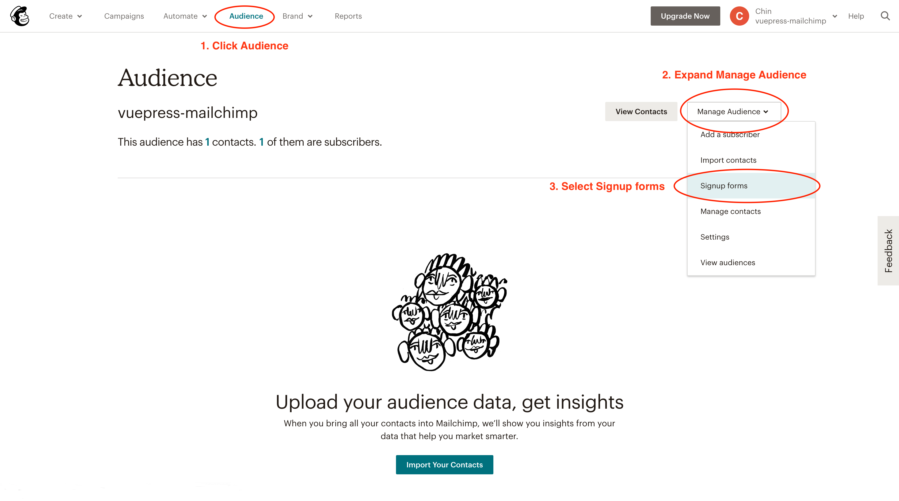
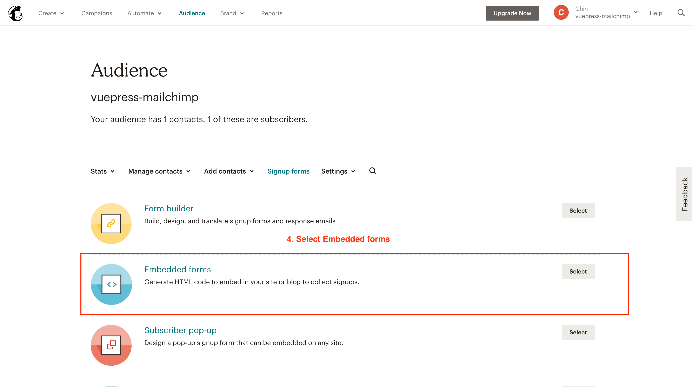
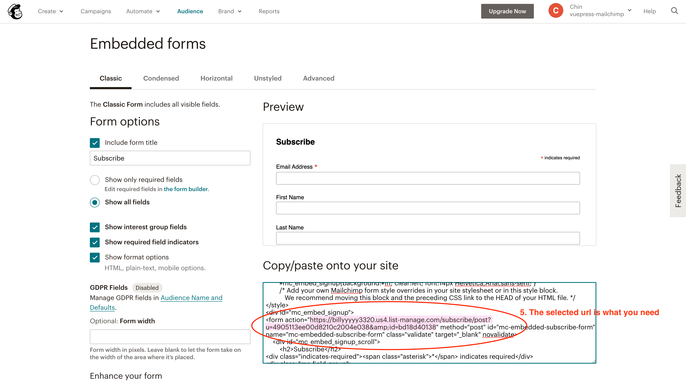

# VuePress-plugin-Mailchimp

Simplifies subscribing new email addresses to a Mailchimp email list.

## Install

First of all, you have to sign up for [Mailchimp](https://mailchimp.com/).

```bash
yarn add vuepress-plugin-mailchimp -D
# OR npm install vuepress-plugin-mailchimp -D
```

## Usage

Take a look at [Using a Plugin](https://vuepress.vuejs.org/plugin/using-a-plugin.html).

```javascript
// .vuepress/config.js
module.exports = {
  plugins: [
    "vuepress-plugin-mailchimp",
    {
      // You need to provide this plugin with your Mailchimp endpoint in order for it
      // to know where to save the email address. See more detail in Config section.
      endpoint: ""
    }
  ]
};
```

### `<SimpleNewsletter/>`

This plugin provides a out-of-box component. Since it has been registered automatically, you can simply put it at your `.md` file.

- Source code:[SimpleNewsletter.vue](https://github.com/newsbielt703/vuepress-plugin-mailchimp/blob/master/src/SimpleNewsletter.vue)
- Usage:

```md
// .md file

...
your content
...

<SimpleNewsletter/>
```

or

```vue
// .vue file

<template>
  <SimplePagination />
</template>

<script>
import { SimpleNewsletter } from "vuepress-plugin-mailchimp/src/SimpleNewsletter";
export default {
  components: {
    SimpleNewsletter
  }
};
</script>
```

- [output](#demo)

## Config

### endpoint

- Type: `string`
- Required: true

How to get your endpoint:





### title

- Type: `string`
- Required: false
- Default: `'NewSletter'`

To be rendered as newsletter's title in `<SimpleNewsletter/>`

### content

- Type: `string`
- Required: false
- Default: `'Subscribe to get my lastest content. No spam.'`

To be rendered as newsletter's content in `<SimpleNewsletter/>`

## Demo

<SimpleNewsletter/>
